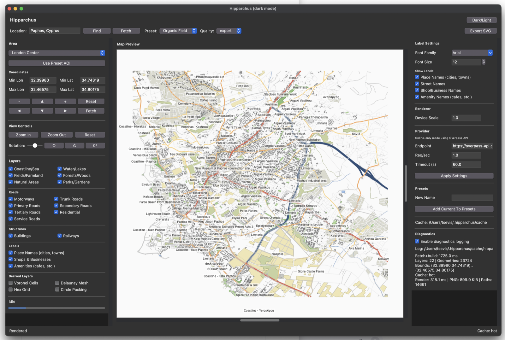

# Hipparchus

**Hipparchus is an online desktop vector cartography app for creating clean, editable maps from OpenStreetMap data and exporting them as Illustrator-friendly SVG files.**



## Introduction

Hipparchus is named after the ancient Greek astronomer, geographer, and cartographer Hipparchus of Nicaea. The app follows that spirit: it is built for people who want to explore geography visually, compose map layers, and produce clean vector artwork rather than browse raster map tiles.

The application fetches live OpenStreetMap data through the Overpass API, renders it in a Tkinter desktop interface, and exports layered SVG maps that can be opened in Adobe Illustrator, Inkscape, Affinity Designer, or other vector tools. It is intentionally focused: online map fetching, clean geometry, fast preview, and simple export.

Hipparchus is a standalone map creation tool focused on live online data, clean rendering, and editable vector export.

## Features

- Online-only OpenStreetMap fetching through Overpass.
- Public Overpass endpoint fallback support.
- Location lookup by place name.
- Manual bounding-box editing.
- Preset areas for quick testing.
- Layer toggles for roads, buildings, water, parks, railways, natural areas, labels, amenities, shops, landuse, barriers, and power features.
- Styled road hierarchy with motorway, trunk, primary, secondary, tertiary, residential, service, and other road classes.
- Visible blue water rendering for lakes and coastline-derived sea areas.
- Cartographic presets including `OSM Standard`, `Urban Structure`, `Fragmented Urban`, `Organic Field`, and `Blueprint Relief`.
- Derived geometry layers including Voronoi cells, Delaunay mesh, hex grid, and circle packing.
- Persistent custom presets saved to the user app data folder.
- Light and dark appearance support using native macOS Aqua where available.
- SVG export with grouped layers and diagnostics JSON.
- No project virtual environment required.

## Screenshot

The screenshot above shows Hipparchus running on macOS in dark appearance, displaying an OpenStreetMap-derived coastal map with configurable layers and online Overpass provider settings.

## Current Status

Hipparchus is a working desktop application under active development. It can fetch real map data, render an interactive preview, and export SVG. Some UI controls are still evolving, and PDF, PNG, and GeoJSON exporters are placeholders.

Recommended workflow:

1. Search for a location or choose a preset area.
2. Keep the area reasonably small.
3. Select only the layers you need.
4. Fetch map data.
5. Adjust visibility, preset, and view.
6. Export SVG.

## System Requirements

### All Platforms

- Python 3.11 or newer.
- Internet connection for new map data.
- Tkinter support in Python.
- Enough memory for Shapely geometry processing.

Runtime Python packages:

- `numpy`
- `scipy`
- `shapely`
- `skia-python`

Development packages:

- `pytest`
- `ruff`

### macOS

Recommended:

- macOS 13 or newer.
- Python from Homebrew, Python.org, Miniconda, or another Python 3.11+ distribution with Tkinter.
- Native Tk Aqua theme is used on macOS.

Install dependencies into your normal Python:

```bash
python3 -m pip install --user numpy scipy shapely skia-python
```

If you use conda/base and `--user` is refused:

```bash
python3 -m pip install numpy scipy shapely skia-python
```

### Windows

Recommended:

- Windows 10 or Windows 11.
- Python 3.11+ from [python.org](https://www.python.org/downloads/windows/) or Miniconda.
- Tkinter is normally included with the standard Python.org installer.

Install dependencies in PowerShell:

```powershell
py -m pip install numpy scipy shapely skia-python
```

Run from PowerShell:

```powershell
cd path\to\Hipparchus
$env:PYTHONPATH = "src;."
py -m hipparchus
```

The included `.sh` launcher scripts are for macOS/Linux shells. Windows users can run the Python module directly as shown above, or use Git Bash/Zsh if available.

### Linux

Recommended:

- Python 3.11+.
- Tkinter system package.
- Basic build/runtime libraries for scientific Python wheels.

On Debian/Ubuntu:

```bash
sudo apt update
sudo apt install python3 python3-pip python3-tk
python3 -m pip install --user numpy scipy shapely skia-python
```

Run:

```bash
cd Hipparchus
./run_hprs.sh
```

If your distribution blocks `pip --user` for system Python, use your distribution package manager, `pipx`, conda, or a user-managed Python installation.

## Installation

Hipparchus is designed to run directly from the source checkout. You do not need a project `venv/` directory and you do not need `pip install -e .` for normal use.

Clone the repository:

```bash
git clone https://github.com/tsevis/Hipparchus.git
cd Hipparchus
```

Install runtime dependencies:

```bash
python3 -m pip install --user numpy scipy shapely skia-python
```

Install development tools if you plan to run tests:

```bash
python3 -m pip install --user pytest ruff
```

The launcher scripts add `src/` and the repository root to `PYTHONPATH` automatically.

## Running Hipparchus

### macOS And Linux

Checked launch:

```bash
./run_hprs_checked.sh
```

Fast launch:

```bash
./run_hprs.sh
```

Direct launch:

```bash
PYTHONPATH=src:. python3 -m hipparchus
```

Use a specific interpreter:

```bash
HIPPARCHUS_PYTHON=/opt/homebrew/bin/python3 ./run_hprs.sh
```

### Windows

PowerShell:

```powershell
$env:PYTHONPATH = "src;."
py -m hipparchus
```

Command Prompt:

```bat
set PYTHONPATH=src;.
py -m hipparchus
```

## Running Checks

macOS/Linux:

```bash
./scripts/release_preflight.sh
```

Windows PowerShell:

```powershell
$env:PYTHONPATH = "src;."
py -m unittest discover -s tests -p "test_*.py"
```

The preflight script:

- Compiles Python files.
- Runs unit tests.
- Confirms `shapely` is available.
- Reports whether `skia-python` is available.

## How It Works

Hipparchus uses a simple pipeline:

1. The user enters or searches for an area of interest.
2. Hipparchus builds an Overpass QL query for the enabled layers.
3. Overpass JSON is converted into layer-separated GeoJSON.
4. Shapely converts GeoJSON into geometry objects.
5. The scene builder clips, simplifies, classifies, and derives geometry.
6. The renderer draws the scene.
7. The export service writes layered SVG paths.

## Online Data Source

Hipparchus fetches OpenStreetMap data from public Overpass API endpoints.

Primary endpoint:

```text
https://overpass-api.de/api/interpreter
```

Fallback endpoints:

```text
https://lz4.overpass-api.de/api/interpreter
https://z.overpass-api.de/api/interpreter
https://overpass.kumi.systems/api/interpreter
```

Public Overpass servers are shared infrastructure. Large areas and heavy layer selections may fail or time out. Keep requests small and respectful.

Useful references:

- [Overpass API documentation](https://dev.overpass-api.de/overpass-doc/en/)
- [Overpass API components and endpoints](https://dev.overpass-api.de/overpass-doc/en/more_info/components.html)

## Supported Layers

Base layers requested from Overpass:

- `roads`
- `buildings`
- `water`
- `parks`
- `railways`
- `forests`
- `fields`
- `natural`
- `coastline`
- `places`
- `shops`
- `amenities`
- `landuse`
- `barriers`
- `power`

Road sublayers generated during scene building:

- `roads_motorway`
- `roads_trunk`
- `roads_primary`
- `roads_secondary`
- `roads_tertiary`
- `roads_residential`
- `roads_service`
- `roads_other`

Derived local geometry layers:

- `voronoi_cells`
- `delaunay_mesh`
- `hex_grid`
- `circle_packing`

## Water And Sea Rendering

Closed lake and reservoir polygons are rendered through the `water` layer. Coastal seas are often represented in OpenStreetMap as coastline lines rather than filled polygons, so Hipparchus derives visible sea polygons from coastline geometry and the current bounding box. This makes coastal water areas render as blue fills behind roads and land features.

## SVG Export

The `Export SVG` button writes:

```text
map.svg
map.svg.diagnostics.json
```

SVG export features:

- Layered SVG groups.
- Clean path output.
- Fill and stroke colors from the active preset.
- Non-scaling strokes.
- Illustrator-friendly structure.
- Diagnostics with path counts per layer.

## Presets

Built-in presets live in:

```text
src/hipparchus/application/presets.py
```

Custom user presets are saved as JSON:

```text
~/.hipparchus/presets.json
```

Override the preset file location:

```bash
HIPPARCHUS_PRESETS_FILE=/path/to/presets.json ./run_hprs.sh
```

## Cache And User Data

Default user data folder:

```text
~/.hipparchus/
```

Important paths:

```text
~/.hipparchus/cache/
~/.hipparchus/cache/overpass/
~/.hipparchus/settings.json
~/.hipparchus/presets.json
~/.hipparchus/projects/
~/.hipparchus/plugins/
```

The Overpass cache makes repeated requests faster and allows recently fetched areas to reload without another network request.

## Environment Variables

```text
HIPPARCHUS_APP_NAME
HIPPARCHUS_THEME
HIPPARCHUS_CACHE_DIR
HIPPARCHUS_PLUGINS_DIR
HIPPARCHUS_PROJECT_DIR
HIPPARCHUS_SETTINGS_FILE
HIPPARCHUS_PRESETS_FILE
HIPPARCHUS_WINDOW_WIDTH
HIPPARCHUS_WINDOW_HEIGHT
HIPPARCHUS_PROVIDER_RPS
HIPPARCHUS_PYTHON
```

Examples:

```bash
HIPPARCHUS_THEME=dark ./run_hprs.sh
```

```bash
HIPPARCHUS_WINDOW_WIDTH=1800 HIPPARCHUS_WINDOW_HEIGHT=1100 ./run_hprs.sh
```

```bash
HIPPARCHUS_PROVIDER_RPS=0.2 ./run_hprs.sh
```

## Project Layout

```text
src/hipparchus/
  application/       Controller, presets, preset persistence, scene builder
  cache/             Disk cache and cache index
  core/              App bootstrap, config, project state, settings
  data_sources/      Overpass provider, query builder, GeoJSON conversion
  export/            SVG export
  geometry/          Derived geometry and simplification tools
  plugins/           Plugin interfaces and loader
  rendering/         Render models and Skia renderer
  ui/                Tkinter main window

tests/               Unit tests
scripts/             Launch and preflight scripts
docs/                Documentation assets and notes
```

## Troubleshooting

### Overpass request failed

Try:

- Reduce the area of interest.
- Disable label-heavy layers such as shops and amenities.
- Disable landuse, barriers, and power if not needed.
- Lower `Req/sec` to `0.2`.
- Increase timeout to `120`.
- Retry later if public endpoints are overloaded.

### The map is blank

Try:

- Click `Reset` in View Controls.
- Confirm at least roads/buildings are enabled.
- Fetch a smaller area.
- Try a known dense preset such as London Center or Athens Center.

### Tkinter is missing

macOS Python.org builds usually include Tkinter. Homebrew and Linux installations may require extra packages.

Linux example:

```bash
sudo apt install python3-tk
```

### Skia is missing

Install:

```bash
python3 -m pip install --user skia-python
```

Hipparchus can start with a fallback renderer, but Skia is recommended for normal visual use.

## Development Notes

Design priorities:

1. Clean vector geometry.
2. Fast rendering.
3. Modular architecture.
4. Minimal dependencies.
5. Illustrator-compatible SVG output.

Before publishing changes:

```bash
./scripts/release_preflight.sh
```

## License

No license file is currently included. Add a license before publishing publicly if you want others to know how they may use, modify, or redistribute the project.
